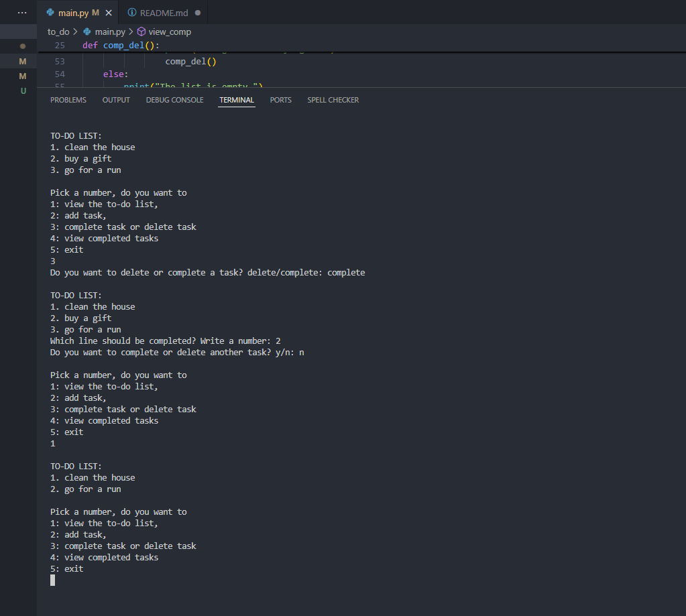

# Python To‑Do List App

A simple console-based to-do list application written in Python.  
This program allows you to manage tasks directly from the terminal, with options to add, view, complete, and delete tasks.

---

## Features
- **View tasks** – Display all current to-do items.
- **Add tasks** – Add one or multiple tasks to the list.
- **Complete or delete tasks** – Mark tasks as completed or remove them entirely.
- **View completed tasks** – See all tasks you have marked as done.
- **Exit** – Close the application.

---

## How to Run
1. Install **Python 3** on your computer.  
You can check if Python is installed by running:
python --version

2. Download or clone this repository to your computer.
3. Open a terminal/command prompt in the project folder.
4. Run the program with:
python todo.py

---

## Screenshot

---

## Author

Created by *Natálie Břichnáčová* as a practice project for learning Python basics.
